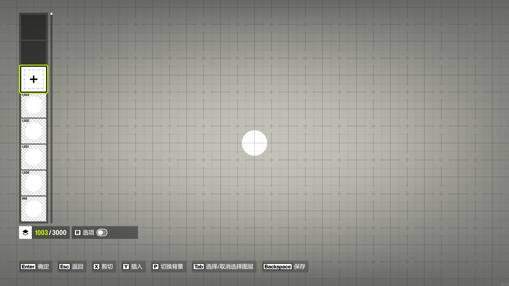
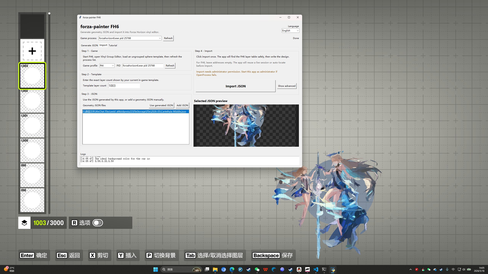

# forza-painter FH6

[English](README.md) | [中文](README.zh-CN.md)

Generate Forza Horizon 6 Vinyl Group layers from images. The desktop app handles generation, preview, and import in one place. Normal users do not need to type memory addresses.

> Import walkthrough video: https://www.bilibili.com/video/BV1hG5Z6nENZ  
> GPU generator reference: https://github.com/zjl88858/forza-painter-geometrize-gpu

This tool has two jobs:

- Generate geometry JSON with the bundled GPU/OpenCL generator.
- Import JSON into the currently open FH6 Vinyl Group Editor.

Normal use does not require manual memory addresses. For FH6 import, select the game process, enter the template layer count, then import.

## Preview

### App Import Page


### Template Ready In FH6



### Imported Result



### Applied To Car


## Quick Start

1. Download this repository as a ZIP and extract it.
2. Install 64-bit Python. Python 3.12 is recommended.
3. Double-click `install_dependencies.bat`.
4. Double-click `start_app.bat`.
5. In FH6, open Vinyl Group Editor, load a sphere template, then Ungroup it.
6. Generate JSON in the app, open the Import page, enter the template layer count, then import.

## Setup

Most users only need to run:

```text
install_dependencies.bat
start_app.bat
```

If the app does not start, run:

```text
check_environment.bat
```

The core Python app only needs `psutil` and `pywin32`. Image/JSON preview uses optional NumPy/OpenCV dependencies; the installer may skip them on Python versions where preview packages are likely to conflict.

## Generate JSON

1. Open the `Generate JSON` page.
2. Click `Add images` and choose PNG/JPG/BMP images.
3. Select a quality preset.
4. Optional: enable `Use custom settings` to change output layers, resolution, random samples, and mutated samples in the app.
5. Click the fixed bottom `Start generating` button.
6. Wait for the preview and logs to update.

Generated files are saved beside the source image, for example:

```text
image.500.json
image.1000.json
image.3000.json
```

One image can generate multiple checkpoint JSON files. Prefer the highest-layer JSON that matches your template; for example, use `image.3000.json` or the final `image.json` with a 3000-layer template. Importing a 500-layer JSON into a 3000-layer template will look blurry.

The left panel can scroll. In small windows, the generate button stays fixed at the bottom.

Recommended quality choices:

| Goal | Recommendation |
| --- | --- |
| Quick composition test | Lower layers and a fast preset |
| Normal use | balanced or slow |
| Maximum clarity | Higher Output layers and a larger template |

## Quality And Custom Settings

Later presets are usually slower and cleaner.

- `extremely fast`: quick composition tests.
- `fast`: quick usable output.
- `balanced`: recommended default.
- `slow`: higher quality.
- `super slow`: slowest bundled preset for final output.

Custom settings only affect the current run. Common fields:

- `Output layers`: maximum layer count.
- `Max resolution`: maximum processing resolution.
- `Random samples`: more candidates, slower generation.
- `Mutated samples`: more optimization, slower generation.
- `Save checkpoints`: JSON checkpoints to save, for example `500,1000,1500,3000`.

## Prepare FH6

1. Start Forza Horizon 6.
2. Open `Create Vinyl Group` / `Vinyl Group Editor`.
3. Load a template made from many simple sphere layers.
4. `Ungroup` the template.
5. Remember the exact layer count shown in game.
6. Keep this editor open while importing.

Recommended template size: 500 to 3000 layers.

## Import JSON

1. Open the `Import` page.
2. Click `Refresh` and select the running `forzahorizon6.exe`.
3. Enter the current in-game template layer count.
4. Add the generated `.json`, or click `Use generated JSON`.
5. Leave advanced address fields empty.
6. Click `Import JSON`.

The app locates and verifies the current FH6 layer table before writing. If the target cannot be verified safely, it stops before writing.

> FH needs 4 extra boundary layers to save the cover and apply bounds correctly.  
> Example: a 1000-layer JSON should use at least a 1004-layer template; a 3000-layer template can import about 2996 drawable shapes.

## Rules

- The template must be ungrouped.
- The layer count in the app must exactly match the game.
- Do not switch game menus while importing.
- After restarting the game, reloading the template, or changing layer count, import again with the new correct count.
- If JSON has fewer layers than the template, unused template layers are hidden.
- If JSON has more layers than the template, extra shapes are trimmed.
- If the imported image looks blurry, you probably imported a low-layer checkpoint or generated too few output layers.
- Transparent PNG backgrounds are not imported as visible backgrounds.

## Changelog

### 2026-05-18

- JSON generation now uses the bundled GPU/OpenCL generator to reduce artifacts from the old generator.
- The app now uses a standalone desktop window with generation, import, preview, and tutorial pages in one place.
- The Generate page has quality presets plus in-app custom settings, so users no longer need to edit config files manually.
- The Import page is simplified for normal users: select the game process, enter the template layer count, choose JSON, then import.
- Fixed an FH6 issue where the design was visible in the editor but saved with a blank cover, pasted blank onto the car, or appeared blank after copying to another vinyl.
- FH import now reserves 4 boundary layers so FH can calculate the saved cover and apply bounds correctly.
- Added environment checks and troubleshooting notes for Python, OpenCL, permissions, and optional preview dependencies.

## Troubleshooting

### GPU Generator Or OpenCL Error

Update the NVIDIA/AMD/Intel graphics driver. The bundled generator is `forza-painter-geometrize-go.exe` and uses OpenCL.

### Python Or Dependency Error

Run:

```powershell
install_dependencies.bat
```

Then run:

```powershell
check_environment.bat
```

`Core OK` means the Python dependencies are installed.

### `_ARRAY_API not found`, NumPy, Or OpenCV Error

This is an optional preview dependency issue. It does not block JSON generation or FH6 import. Reinstall core dependencies first:

```powershell
python -m pip install -r requirements.txt
```

### `OpenProcess` Or Permission Error

Close the app and run `start_app.bat` as administrator.

JSON generation does not need administrator permission. FH6 import usually does.

### Game Process Not Found

Start FH6 first, then click `Refresh`. If it still does not appear, restart the app.

### No Safe Template Found

Check:

- You are in Vinyl Group Editor.
- The template is ungrouped.
- The layer count is exact.
- You did not switch menus after entering the count.

### Import Looks Cut Off

The template has too few layers. Use a larger template or generate fewer JSON layers.

## Files

Most users only need:

- `install_dependencies.bat`: install Python dependencies.
- `start_app.bat`: start the app.
- `check_environment.bat`: check the environment.
- `clean_runtime_data.bat`: remove runtime caches before publishing or re-zipping.
- `1. drag_image_file_here.bat`: optional shortcut for dragging an image into the app.

Do not publish runtime cache folders such as `webui-data`, `runtime`, `__pycache__`, or `dist`.
